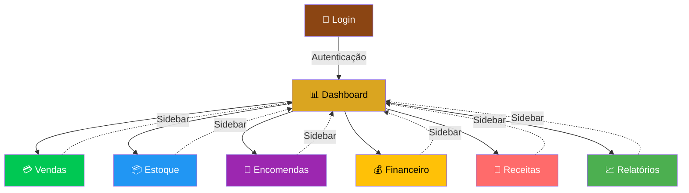

# 🎯 PROPOSTA DE REESTRUTURAÇÃO - COLHERADA

## 📊 SITUAÇÃO ATUAL vs PROPOSTA

### ❌ ANTES (Página Única)
```
┌──────────────────────────────────────┐
│           index.html                 │
│                                      │
│  📦 Estoque: 25                     │
│  💰 Faturamento: R$ 150             │
│  📈 Lucro: R$ 90                    │
│                                      │
│  ══════════════════════════════     │
│  💳 REGISTRAR VENDA                 │
│  [formulário]                        │
│  ══════════════════════════════     │
│  📦 GERENCIAR ESTOQUE               │
│  [formulário]                        │
│  ══════════════════════════════     │
│  📝 REGISTRAR ENCOMENDA             │
│  [formulário]                        │
│  ══════════════════════════════     │
│  📋 HISTÓRICO DE VENDAS             │
│  [tabela gigante]                   │
│  ══════════════════════════════     │
│  📖 ANOTAÇÕES DE RECEITAS           │
│  [editor de texto]                  │
│  ══════════════════════════════     │
│  📊 RELATÓRIOS E ANÁLISES           │
│  [gráficos e tabelas]               │
│  ══════════════════════════════     │
│                                      │
│  ⬇️ [Scroll infinito] ⬇️            │
└──────────────────────────────────────┘

PROBLEMAS:
❌ Interface poluída e confusa
❌ Muito scroll para acessar funções
❌ Difícil encontrar o que precisa
❌ Não é intuitivo para novos usuários
❌ Péssima experiência mobile
```

### ✅ DEPOIS (Sistema Multi-Página com Sidebar)
```
┌─────────┬──────────────────────────────┐
│         │                              │
│  🍮     │     📊 DASHBOARD             │
│ MENU    │                              │
│         │  ┌──────┐ ┌──────┐ ┌──────┐ │
│ ┌─────┐ │  │📦 25 │ │💰 150│ │📈 90 │ │
│ │📊   │ │  └──────┘ └──────┘ └──────┘ │
│ │Dash │←├─ PÁGINA ATIVA               │
│ └─────┘ │                              │
│         │  💳 Últimas 5 Vendas         │
│ ┌─────┐ │  ⏰ Encomendas Urgentes      │
│ │💳   │ │                              │
│ │Venda│ │                              │
│ └─────┘ │  [Visão rápida e limpa]     │
│         │                              │
│ ┌─────┐ │                              │
│ │📦   │ │                              │
│ │Estoq│ │                              │
│ └─────┘ │                              │
│         │                              │
│ ┌─────┐ │                              │
│ │📝   │ │                              │
│ │Encom│ │                              │
│ └─────┘ │                              │
│         │                              │
│   ...   │                              │
│         │                              │
│ ┌─────┐ │                              │
│ │🚪   │ │                              │
│ │Sair │ │                              │
│ └─────┘ │                              │
└─────────┴──────────────────────────────┘

VANTAGENS:
✅ Interface limpa e organizada
✅ Navegação rápida (1 clique)
✅ Foco em uma tarefa por vez
✅ Intuitivo e profissional
✅ Excelente experiência mobile
```

---

## 🗺️ ESTRUTURA DE NAVEGAÇÃO



---

## 📱 PÁGINAS DO SISTEMA

### 1️⃣ 📊 DASHBOARD (Página Inicial)
**Objetivo:** Visão geral rápida do dia

**O que mostra:**
- ✅ Estoque atual (com alerta se baixo)
- ✅ Faturamento bruto de hoje
- ✅ Lucro líquido de hoje
- ✅ Encomendas pendentes (contador)
- ✅ Últimas 5 vendas
- ✅ Encomendas urgentes (próximos 3 dias)
- ✅ Alertas importantes

**Ações:**
- Ver resumo rápido sem interagir
- Clicar em "Ver todas" para ir para página específica

---

### 2️⃣ 💳 VENDAS
**Objetivo:** Registrar vendas rapidamente

**O que mostra:**
- ✅ Resumo rápido (estoque, vendas, faturamento)
- ✅ Formulário de nova venda
  - Quantidade de pudins
  - Valor unitário
  - Total calculado automaticamente
- ✅ 3 botões grandes: PIX, Dinheiro, Cartão
- ✅ Histórico completo de vendas do dia
- ✅ Estatísticas (total vendas, quantidade, faturamento)

**Ações:**
- ➕ Registrar venda com 1 clique
- 📋 Ver histórico completo
- 🔄 Atualizar dados

---

### 3️⃣ 📦 ESTOQUE
**Objetivo:** Controlar entrada e saída de produtos

**O que mostra:**
- ✅ Status do estoque (atual, vendidos hoje, produzidos hoje)
- ✅ Alertas de estoque crítico/baixo
- ✅ Formulário para abastecer (produção)
- ✅ Formulário para remover (perda, doação, etc.)
- ✅ Histórico de movimentações
- ✅ Previsão de produção inteligente
  - Média de vendas
  - Encomendas próximas
  - Sugestão de quantidade a produzir

**Ações:**
- ➕ Abastecer estoque
- ➖ Remover do estoque
- 📊 Ver histórico
- 💡 Ver previsão de produção

---

### 4️⃣ 📝 ENCOMENDAS
**Objetivo:** Agendar e gerenciar pedidos futuros

**O que mostra:**
- ✅ Calendário visual (opcional)
- ✅ Formulário de nova encomenda
  - Cliente
  - Quantidade
  - Data de entrega
  - Telefone
- ✅ Lista de encomendas pendentes
  - Urgentes (hoje) em destaque
  - Próximos 3 dias
  - Todas as futuras
- ✅ Estatísticas (pendentes, concluídas do mês)

**Ações:**
- ➕ Registrar nova encomenda
- ✅ Concluir encomenda
- ❌ Cancelar encomenda
- 📅 Ver calendário

---

### 5️⃣ 💰 FINANCEIRO
**Objetivo:** Análise completa de receitas e lucros

**O que mostra:**
- ✅ Resumo do dia (faturamento, custos, lucro)
- ✅ Vendas por forma de pagamento
  - PIX: valor e percentual
  - Dinheiro: valor e percentual
  - Cartão: valor e percentual
- ✅ Gráfico de evolução mensal
- ✅ Configurações financeiras
  - Valor unitário de venda
  - Custo unitário
  - Margem de lucro
- ✅ Resumo do mês

**Ações:**
- 📊 Ver análises financeiras
- ⚙️ Ajustar valores e custos
- 📈 Ver evolução

---

### 6️⃣ 📖 RECEITAS
**Objetivo:** Anotações de receitas e proporções

**O que mostra:**
- ✅ Editor de texto para anotações
- ✅ Campo para título
- ✅ Área para ingredientes
- ✅ Área para modo de preparo
- ✅ Dicas e observações
- ✅ Calculadora de proporções (opcional)
  - Inserir quantidade desejada
  - Sistema calcula ingredientes necessários

**Ações:**
- 💾 Salvar receita
- 📖 Carregar receita salva
- 🧮 Calcular proporções

---

### 7️⃣ 📈 RELATÓRIOS
**Objetivo:** Análises e gráficos de desempenho

**O que mostra:**
- ✅ Seleção de período (data início/fim)
- ✅ Resumo geral do período
  - Total de vendas
  - Faturamento
  - Lucro
  - Ticket médio
- ✅ Gráfico de crescimento mensal
- ✅ Produtos mais vendidos
- ✅ Melhor dia do período
- ✅ Formas de pagamento (gráfico pizza)
- ✅ Detalhamento de todas as vendas

**Ações:**
- 📊 Gerar relatório por período
- 📥 Exportar para PDF
- 📥 Exportar para Excel
- 🖨️ Imprimir relatório

---

## 🎨 DESIGN VISUAL

### Paleta de Cores
```
🍮 Marrom (Principal):  #8B4513  ████  (sidebar, títulos)
🍮 Marrom Claro:        #D2691E  ████  (destaques)
✨ Dourado:             #DAA520  ████  (bordas, ícones)
📄 Branco:              #FFFFFF  ████  (cards, fundo)
🌾 Bege:                #F5F5F0  ████  (fundo geral)

💳 PIX (Verde):         #00C853  ████
💵 Dinheiro (Azul):     #2196F3  ████
💳 Cartão (Roxo):       #9C27B0  ████
⚠️  Alerta (Amarelo):   #FFC107  ████
```

### Tipografia
- **Títulos:** 'Segoe UI' Bold
- **Texto:** 'Segoe UI' Regular
- **Números:** 'Segoe UI' Bold (destaque)

### Ícones
Usando emojis nativos para máxima compatibilidade:
- 📊 Dashboard
- 💳 Vendas
- 📦 Estoque
- 📝 Encomendas
- 💰 Financeiro
- 📖 Receitas
- 📈 Relatórios

---

## 📱 RESPONSIVIDADE

### Desktop (> 768px)
```
┌──────────┬─────────────────────────┐
│          │                         │
│ SIDEBAR  │    CONTEÚDO             │
│  260px   │    (restante)           │
│  FIXA    │    ROLÁVEL              │
│          │                         │
└──────────┴─────────────────────────┘
```

### Tablet (≤ 768px)
```
┌─────────────────────────────────┐
│  ☰ [Toggle]                     │
├─────────────────────────────────┤
│                                 │
│     CONTEÚDO                    │
│     (largura total)             │
│                                 │
└─────────────────────────────────┘

[Sidebar aparece em overlay quando clicar ☰]
```

### Mobile (≤ 480px)
- Cards empilhados verticalmente
- Tabelas com scroll horizontal
- Botões em tamanho completo
- Formulários otimizados para toque

---

## ⚡ TECNOLOGIAS UTILIZADAS

### Frontend
- ✅ **HTML5** - Estrutura semântica
- ✅ **CSS3** - Estilização moderna (Grid, Flexbox)
- ✅ **JavaScript ES6+** - Lógica e interatividade
- ✅ **Fetch API** - Comunicação com backend
- ✅ **SessionStorage** - Autenticação

### Backend (já existente)
- ✅ **Python 3** - Linguagem
- ✅ **Flask** - Framework web
- ✅ **SQLite** - Banco de dados
- ✅ **Flask-CORS** - Permitir requisições cross-origin

### Deploy
- ✅ **Render.com** - Hospedagem gratuita

---

## ✨ DIFERENCIAIS DESTA SOLUÇÃO

### 🎯 Organização
- Cada funcionalidade tem sua própria página
- Fácil encontrar o que precisa
- Reduz sobrecarga cognitiva

### ⚡ Performance
- Carrega apenas o necessário
- Páginas leves e rápidas
- Transições suaves

### 🧠 Usabilidade
- Navegação intuitiva
- Sidebar sempre visível
- 1 clique para qualquer função

### 📱 Mobile-First
- Interface adaptada para celular
- Botões grandes e touch-friendly
- Menu overlay otimizado

### 🔧 Manutenibilidade
- Código modular
- Fácil adicionar novas páginas
- CSS e JS separados por funcionalidade

### 🚀 Escalável
- Preparado para crescer
- Fácil adicionar novas features
- Estrutura profissional

### 🎨 Profissional
- Design moderno e limpo
- Consistência visual
- Experiência premium

---

## 📊 COMPARAÇÃO DE EXPERIÊNCIA

### Tarefa: Registrar uma venda

**ANTES (Página Única):**
1. Abrir site ⏱️
2. Rolar até seção de vendas ⏱️⏱️
3. Preencher formulário ⏱️
4. Clicar em forma de pagamento ⏱️
5. Rolar para verificar se foi registrado ⏱️⏱️

**Total: ~30 segundos + 5 ações**

**DEPOIS (Multi-Página):**
1. Abrir site ⏱️
2. Clicar em "Vendas" na sidebar ⏱️
3. Digitar quantidade ⏱️
4. Clicar em PIX/Dinheiro/Cartão ⏱️

**Total: ~10 segundos + 4 ações**

### 🎯 **Redução de 67% no tempo!**

---

## 🔒 SEGURANÇA

- ✅ Autenticação obrigatória
- ✅ Token de sessão
- ✅ Verificação em todas as páginas
- ✅ Logout seguro
- ✅ Comunicação HTTPS (em produção)

---

## 🎓 APRENDIZADO E EVOLUÇÃO

Esta estrutura permite:

1. **Adicionar novas páginas facilmente**
   - Copiar estrutura existente
   - Personalizar conteúdo
   - Adicionar link na sidebar

2. **Evoluir funcionalidades**
   - Cada página é independente
   - Não afeta outras seções
   - Teste isolado

3. **Integrar novas tecnologias**
   - Gráficos (Chart.js)
   - Calendário (FullCalendar)
   - PWA (App instalável)
   - Notificações Push

---

## ✅ STATUS DA IMPLEMENTAÇÃO

### 🟢 Completo (Pronto para usar)
- ✅ Estrutura base (HTML, CSS, JS)
- ✅ Sistema de autenticação
- ✅ Sidebar de navegação
- ✅ Página Dashboard
- ✅ Página Vendas
- ✅ Página Estoque
- ✅ Integração com backend
- ✅ Responsividade mobile
- ✅ Documentação completa

### 🟡 A completar (seguir o padrão)
- ⚠️ Página Encomendas
- ⚠️ Página Financeiro
- ⚠️ Página Receitas
- ⚠️ Página Relatórios
- ⚠️ Atualizar index.html (apenas login)

---

## 🚀 PRÓXIMOS PASSOS

1. **Revisar as páginas criadas**
   - Abrir `dashboard.html`, `vendas.html`, `estoque.html`
   - Testar navegação e funcionalidades
   - Verificar design e responsividade

2. **Criar páginas restantes**
   - Usar as páginas criadas como template
   - Seguir o mesmo padrão de estrutura
   - Consultar `GUIA_IMPLEMENTACAO.md`

3. **Testar o sistema completo**
   - Iniciar servidor Flask
   - Testar em diferentes navegadores
   - Testar em diferentes dispositivos

4. **Deploy na nuvem**
   - Seguir instruções do `GUIA_DEPLOY.md`
   - Fazer upload para GitHub
   - Conectar com Render.com

---

## 📚 DOCUMENTAÇÃO DISPONÍVEL

1. **ARQUITETURA.md** - Documentação visual completa com wireframes
2. **GUIA_IMPLEMENTACAO.md** - Guia passo a passo para completar o sistema
3. **GUIA_DEPLOY.md** - Como fazer deploy no Render.com
4. **Este arquivo** - Resumo visual da proposta

---

## 💪 VANTAGENS COMPETITIVAS

Comparado com um sistema de página única:

| Aspecto | Página Única | Multi-Página (Proposto) |
|---------|--------------|-------------------------|
| **Organização** | ❌ Confuso | ✅ Limpo e claro |
| **Navegação** | ❌ Scroll infinito | ✅ 1 clique |
| **Performance** | ❌ Carrega tudo | ✅ Carrega necessário |
| **Mobile** | ❌ Difícil usar | ✅ Otimizado |
| **Manutenção** | ❌ Complexa | ✅ Simples |
| **Escalabilidade** | ❌ Limitada | ✅ Ilimitada |
| **Profissionalismo** | ❌ Amador | ✅ Profissional |

---

## 🎯 CONCLUSÃO

Esta reestruturação transforma seu sistema de vendas em uma **solução profissional e moderna**, mantendo todas as funcionalidades existentes mas com uma **experiência muito superior**.

✨ **Interface limpa e organizada**  
⚡ **Navegação rápida e intuitiva**  
📱 **Perfeitamente responsivo**  
🚀 **Pronto para crescer**  

---

**Desenvolvido para Colherada 🍮**  
*Da confusão à clareza. Da complexidade à simplicidade.*
